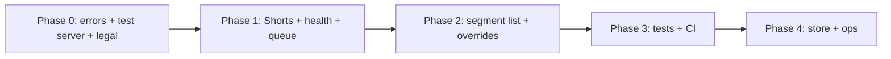

# Skippy production readiness plan

Roadmap for taking the browser extension (and its backend) from dev-ready to production-ready.

**Repos involved**

| Repo | Role |
|------|------|
| `skippy-plugin` | Firefox/Chrome extension (`plugin/`) |
| `skippy-youtube-api` | Flask API, ML pipeline, database |

**Current baseline** — Core loop works: configure server URL → fetch intervals on `/watch` pages → poll while pending → auto-skip → popup badge + toasts. Good for personal/dev use; gaps are reliability, coverage, trust, and ops.

---

## Phase 0 — Ship blockers (do first)

These block a credible public v1. Complete before store submission or inviting non-technical users.

### Plugin

- [ ] **Surface network and HTTP errors in the UI**
  - Unreachable server, timeout, invalid URL, unexpected 4xx/5xx → popup shows **Failed** with a clear message (not only `console.error`)
  - Audit silent `.catch(() => {})` paths in `processor.js` and `popup.js`
  - Files: `plugin/processor.js`, `plugin/popup.js`, `plugin/popup.html`

- [ ] **Validate server URL on save**
  - Reject empty/malformed URLs before writing to `storage.sync`
  - Normalize trailing slashes (already partially done)
  - Files: `plugin/popup.js`

- [ ] **Add “Test connection” in popup**
  - Hit `{server}/api/test` (or a dedicated `/health`) on save or via a button
  - Show success/failure toast before user opens a video
  - Files: `plugin/popup.js`, `plugin/popup.html`

- [ ] **Replace settings polling with `storage.onChanged`**
  - Remove 1s `setInterval(loadSettings)` in `processor.js`
  - Files: `plugin/processor.js`

- [ ] **Narrow `host_permissions`**
  - If hosting a single API: restrict to that origin + `http://localhost:*/*` for dev
  - Document how self-hosters add their origin (or use optional permissions)
  - Files: `plugin/manifest.json`, `README.md`

- [ ] **Privacy policy and data disclosure**
  - Extension sends full YouTube watch URLs to the configured server
  - Publish a privacy policy URL; link from popup and store listing
  - Required for AMO and Chrome Web Store

- [ ] **Store assets**
  - Replace placeholder `icons/icon-48.png`
  - Provide full icon set: 16, 32, 48, 96, 128
  - Screenshots, short + long store descriptions, support contact

- [ ] **License**
  - Choose and document OSS or proprietary license in `README.md` and repo

### Backend (`skippy-youtube-api`)

- [ ] **Hosted HTTPS API** (or explicit “bring your own server” positioning with setup guide)
- [ ] **Production runtime** — Gunicorn (or similar) behind reverse proxy with TLS; not `flask run`
- [ ] **`/health` and `/ready` endpoints** — DB connectivity, models loaded; plugin can use for connection test
- [ ] **Rate limiting** — per-IP and cap concurrent analyses (ML is expensive)
- [ ] **Auth** — at minimum API keys for a public hosted API; extension sends key in header or query
- [ ] **Secrets** — no dev passwords in production compose; use env/secrets manager

---

## Phase 1 — Reliability and YouTube coverage

### Plugin

- [ ] **YouTube Shorts support**
  - Add content script matches for `https://www.youtube.com/shorts/*`
  - Verify skip logic works with Shorts player layout
  - Files: `plugin/manifest.json`, `plugin/processor.js`, possibly `notifications.js`

- [ ] **Broader URL coverage** (as needed)
  - Embeds: `https://www.youtube.com/embed/*`
  - Ensure `youtu.be` redirects still land on `/watch` (may be sufficient without extra matches)

- [ ] **Defensive player detection**
  - Fallback selectors if primary `<video>` or `.html5-video-player` missing
  - Optional MutationObserver for late-mounted players
  - Files: `plugin/processor.js`, `plugin/notifications.js`

- [ ] **Cancel in-flight fetches on navigation**
  - Confirm `fetchGeneration` + `AbortController` on video/tab change
  - Files: `plugin/processor.js`

- [ ] **First-run onboarding**
  - Default hosted API URL (if applicable) or clear empty state
  - Short “1. Set server → 2. Open a video → 3. Done” copy in popup
  - Link to docs and privacy policy
  - Files: `plugin/popup.html`, `plugin/popup.js`

- [ ] **Update README**
  - Document `background.js`, `notifications.js`, badge states, notify levels, pause toggle
  - Cross-link `skippy-youtube-api` setup
  - Files: `README.md`

### Backend

- [ ] **Job queue for analysis** — Celery/RQ/Redis (or equivalent); workers stateless for multi-instance deploy
- [ ] **Structured logging** — request IDs, analysis duration, failure reasons
- [ ] **Route-level API tests** — `tests/server/api/` for pending/ready/failed/retry contract
  - Align with plugin expectations documented in `README.md`

---

## Phase 2 — User trust and control

### Plugin

- [ ] **Segment list in popup**
  - Show detected intervals: time range + `orgs` when available
  - Helps users verify skips before/during playback
  - Files: `plugin/popup.html`, `plugin/popup.js` (may need content script to pass intervals)

- [ ] **Per-video override**
  - “Don’t skip this video” — local allowlist/denylist in `storage.local`
  - Files: `plugin/processor.js`, `plugin/popup.js`

- [ ] **Per-channel override** (optional)
  - Skip or never-skip for channel ID extracted from page or API

- [ ] **Manual seek-back after skip**
  - Toast action: “Undo skip” → seek to `start_time` of last skipped segment
  - Files: `plugin/notifications.js`, `plugin/processor.js`

- [ ] **Wrong-skip feedback** (optional)
  - “Report incorrect segment” → POST to backend for review/retraining
  - Requires backend endpoint

- [ ] **Session stats** (optional)
  - “Skipped Xm Ys this session” in popup

### Backend

- [ ] **Feedback endpoint** for incorrect segments (if plugin reports)
- [ ] **API versioning** — document breaking changes; plugin handles unknown fields gracefully

---

## Phase 3 — Quality engineering

### Plugin

- [ ] **Automated tests**
  - `parseIntervals()` validation (numeric bounds, required fields)
  - Video ID / URL change detection logic
  - Message protocol: `get-status`, `retry-analysis`, `analysis-status`
  - Tooling: small Node test runner or browser-based harness (no bundler required unless justified)

- [ ] **Manual regression checklist** (keep in CI or CONTRIBUTING)
  1. Reload extension in Firefox and Chrome
  2. Refresh YouTube tabs
  3. Server URL persists across restart
  4. GET `/api/v2/timestamps?link=...` on watch page
  5. Playback jumps past known intervals
  6. SPA navigation fetches new timestamps
  7. Pending → poll → ready; failed → Try again with `retry=1`
  8. Auto-skip off → badge Paused, no seek
  9. Notify levels: off / minimal / detailed

### Backend

- [ ] **CI pipeline** (GitHub Actions or similar)
  - `PYTHONPATH=. python -m unittest discover -s tests -p "test_*.py"` on every PR
  - Docker image build on merge to main
- [ ] **Integration test** — extension contract against running API (optional smoke job)

### Both

- [ ] **Align console prefix** — `[YouTube Tracker]` vs `[Youtube Tracker]` typo in `processor.js`
- [ ] **Bump `manifest.json` version** for each user-facing release

---

## Phase 4 — Store launch and ops

### Store submission

- [ ] **Firefox AMO** — `browser_specific_settings.gecko.id` set (`id@skippy-youtube`); review data collection disclosure
- [ ] **Chrome Web Store** — one-time developer fee; MV3 compliance
- [ ] **Listing copy** — features, limitations (watch pages only until Shorts done), self-host vs hosted API
- [ ] **Support channel** — GitHub issues, email, or Discord

### Backend ops

- [ ] **Observability** — metrics (request rate, analysis latency, failure rate), error tracking (e.g. Sentry)
- [ ] **Alerting** — API down, DB unreachable, queue backlog
- [ ] **Backups** — MySQL backup/restore documented
- [ ] **Deploy runbook** — env vars, migrations (`alembic upgrade head`), rollback steps
- [ ] **Scaling** — horizontal workers + shared queue; no reliance on in-process `_active_jobs` only

---

## Priority diagram

---

## Decision log (fill in as you go)

| Decision | Options | Choice | Date |
|----------|---------|--------|------|
| Hosted vs self-host only | Hosted API / BYOS / both | | |
| Auth model | API key / none for self-host | | |
| `host_permissions` | Single origin / optional permissions | | |
| Shorts in v1 | Yes / post-v1 | | |
| License | MIT / Apache-2.0 / proprietary | | |

---

## Out of scope (unless product direction changes)

- Build tooling / bundlers in `plugin/` (stay vanilla JS per project rules)
- YouTube mobile app
- Per-user accounts in extension (unless backend adds multi-tenancy)
- Offline / cached intervals without server round-trip

---

## References

- Extension API contract: `README.md` (pending / ready / failed, `retry=1`)
- Agent conventions: `.cursor/rules/browser-extension.mdc`
- Backend architecture: `skippy-youtube-api` `.cursor/rules/agents.mdc`
